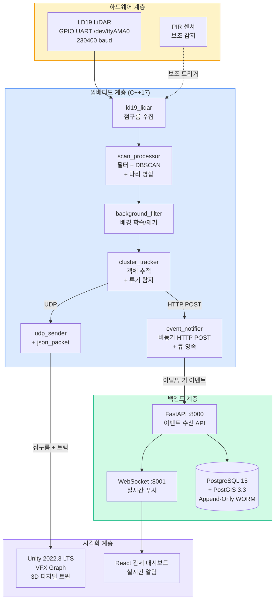

<p align="center">
  <h1 align="center">데이터 무결성 보증형 디지털 트윈 관제 플랫폼</h1>
  <p align="center">
    LD19 LiDAR 기반 실시간 불법 투기 자동 탐지 및 조작 불가 증거 보존 시스템
  </p>
</p>

<p align="center">
  <a href="https://github.com/features/actions"></a>
  <a href="./LICENSE"></a>
  
  
  
  
  
</p>

---

## 목차

- [프로젝트 개요](#프로젝트-개요)
- [주요 기능](#주요-기능)
- [시스템 아키텍처](#시스템-아키텍처)
- [기술 스택](#기술-스택)
- [폴더 구조](#폴더-구조)
- [실행 방법](#실행-방법)
  - [방법 A — 실제 센서](#방법-a--실제-센서-ld19-lidar-연결)
  - [방법 B — 시뮬레이션](#방법-b--시뮬레이션-센서-없이-테스트)
- [핵심 파라미터](#핵심-파라미터)
- [API 명세](#api-명세)
- [보안 아키텍처](#보안-아키텍처)
- [팀 구성](#팀-구성)
- [라이선스](#라이선스)

---

## 프로젝트 개요

불법 투기 현장을 **LD19 LiDAR 센서**로 24시간 실시간 감시하고, 투기 행위가 감지되면 **조작 불가능한 증거**를 자동으로 보존하는 디지털 트윈 관제 플랫폼입니다.

기존 CCTV 기반 감시 시스템의 한계(사각지대, 야간 취약, 영상 위변조 가능성)를 극복하기 위해, LiDAR 점구름 데이터를 기반으로 객체를 추적하고, PostgreSQL Append-Only 구조로 모든 이벤트 로그의 **위변조를 원천 차단**합니다.

- **개발 기간**: 2026년 (8주)
- **팀 규모**: 4인

---

## 주요 기능

| 기능 | 설명 |
|------|------|
| **실시간 점구름 수집** | LD19 LiDAR로 360° 2D 점구름을 10Hz로 수집, 직교좌표 변환 |
| **투기 자동 탐지** | DBSCAN 클러스터링 + 궤적 기반 분리 감지로 사람이 물건을 놓고 떠나는 행위 탐지 |
| **증거 무결성 보장** | PostgreSQL Append-Only + 트리거 기반 WORM 구조로 로그 위변조 원천 차단 |
| **실시간 경보** | WebSocket 기반 0.1초 미만 이벤트 푸시, 관제 대시보드 즉시 알림 |
| **3D 디지털 트윈** | Unity VFX Graph로 LiDAR 점구름 + 추적 객체를 실시간 3D 시각화 |
| **다중 보안 체계** | Zero Trust + OIDC/SAML SSO + RBAC + 2FA, TLS/SSH 전 구간 암호화 |

---

## 시스템 아키텍처



### 데이터 흐름

```
LD19 LiDAR (GPIO UART, 230400 baud, 10Hz)
    │
    ▼
scan_processor ── 필터(200~5000mm) → 직교좌표 → DBSCAN(ε=150mm) → 다리 병합
    │
    ▼
background_filter ── 50프레임 학습 → 배경 제거 → 적응형 업데이트
    │
    ▼
cluster_tracker ── 객체 추적 → 궤적 분석 → 투기 탐지(suspect → confirm)
    │                                          │
    ├── HTTP POST ──→ FastAPI ──→ PostgreSQL    │
    │                    └──→ WebSocket → 대시보드
    │                                          │
    └── UDP ────────→ Unity 3D VFX Graph ──────┘
```

---

## 기술 스택

| 계층 | 기술 | 비고 |
|------|------|------|
| **하드웨어** | LD19 LiDAR (LDROBOT), PIR 센서 | GPIO UART 230400 baud |
| **임베디드** | C++17, ldlidar_stl_sdk, POSIX socket | Grid-DBSCAN, 궤적 기반 투기 탐지 |
| **백엔드** | Python 3.11, FastAPI, WebSocket | 0.1초 미만 이벤트 푸시 |
| **데이터베이스** | PostgreSQL 15 + PostGIS 3.3 | WORM/Append-Only, 트리거 기반 위변조 차단 |
| **시각화** | Unity 2022.3 LTS, VFX Graph | UDP 실시간 수신, 3D 디지털 트윈 |
| **보안** | OIDC/SAML SSO, RBAC, 2FA, Zero Trust | TLS/SSH 전 구간 암호화 |
| **빌드** | CMake 3.16+, FetchContent (nlohmann/json) | libcurl, ldlidar_stl_sdk 정적 링크 |

---

## 폴더 구조

```
Embedded_LD19/
├── CMakeLists.txt                # C++ 빌드 설정
├── setup.sh                      # 원클릭 의존성 설치 + 빌드
├── LICENSE                       # MIT License
├── README.md                     # 이 문서
│
├── src/                          # C++ 소스
│   ├── main.cpp                  # 진입점, 파이프라인 통합
│   ├── sim_main.cpp              # 시뮬레이션 진입점 (센서 불필요)
│   ├── ld19_lidar.cpp            # LD19 시리얼 연결 및 스캔
│   ├── scan_processor.cpp        # 필터링 + DBSCAN + 클러스터 병합
│   ├── background_filter.cpp     # 배경 학습 및 적응형 필터
│   ├── cluster_tracker.cpp       # 다중 객체 추적 + 투기 탐지
│   ├── event_notifier.cpp        # 비동기 HTTP POST + 큐 영속
│   ├── json_packet.cpp           # JSON 패킷 직렬화
│   └── udp_sender.cpp            # UDP 전송 (바이너리/JSON)
│
├── include/                      # C++ 헤더
│   ├── ld19_lidar.h
│   ├── scan_processor.h
│   ├── background_filter.h
│   ├── cluster_tracker.h
│   ├── event_notifier.h
│   ├── json_packet.h
│   └── udp_sender.h
│
├── server/                       # FastAPI 백엔드
│   └── main.py                   # 이벤트 수신 API + 조회 API
│
├── unity/                        # Unity 수신 컴포넌트
│   ├── LD19Receiver.cs           # 바이너리 UDP 패킷 파서
│   └── LD19JsonReceiver.cs       # JSON UDP 패킷 파서
│
└── thirdparty/
    └── ldlidar_stl_sdk/          # LDROBOT 공식 SDK (git clone)
```

---

## 실행 방법

### 방법 A — 실제 센서 (LD19 LiDAR 연결)

#### Step 1. GPIO UART 활성화 (최초 1회)

LD19 센서를 라즈베리파이 GPIO에 배선합니다:

```
LD19 핀        라즈베리파이 GPIO
─────────      ──────────────────
TX   ────────→ GPIO15 (RXD, Pin 10)
RX   ────────→ GPIO14 (TXD, Pin 8)
GND  ────────→ GND (Pin 6)
5V   ────────→ 5V  (Pin 2 또는 Pin 4)
```

UART를 활성화합니다:

```bash
sudo raspi-config
# → Interface Options → Serial Port
# → "login shell over serial" → No
# → "serial port hardware enabled" → Yes
# → 재부팅
```

또는 직접 설정:

```bash
echo "enable_uart=1" | sudo tee -a /boot/config.txt
sudo systemctl disable serial-getty@ttyAMA0.service
sudo reboot
```

#### Step 2. 센서 연결 확인

```bash
ls /dev/ttyAMA0
# /dev/ttyAMA0 이 보여야 정상
```

#### Step 3. 시리얼 포트 권한 설정 (최초 1회)

```bash
sudo usermod -aG dialout $USER
# 반드시 로그아웃 후 재로그인
```

#### Step 4. 빌드 (최초 1회)

자동 설치 (권장):

```bash
chmod +x setup.sh
./setup.sh
```

또는 수동 빌드:

```bash
sudo apt update
sudo apt install -y build-essential cmake git libcurl4-openssl-dev

mkdir -p thirdparty
git clone https://github.com/ldrobotSensorTeam/ldlidar_stl_sdk.git thirdparty/ldlidar_stl_sdk

mkdir -p build && cd build
cmake .. -DCMAKE_BUILD_TYPE=Release
make -j$(nproc)
```

빌드 결과물:

| 파일 | 용도 |
|------|------|
| `build/ld19_lidar_app` | 실제 센서 실행 (LD19 연결 필수) |
| `build/ld19_sim` | 시뮬레이션 실행 (센서 불필요) |

#### Step 5. 실행

```bash
sudo ./build/ld19_lidar_app
```

인자 없이 실행하면 아래 기본값이 적용됩니다:

| 인자 | 기본값 | 설명 |
|------|--------|------|
| argv[1] | `/dev/ttyAMA0` | LD19 GPIO UART 포트 |
| argv[2] | `https://lorinda-nonexponible-zita.ngrok-free.dev/api/dumping-event` | 이벤트 수신 API URL |
| argv[3] | `127.0.0.1:9090` | Unity UDP 수신 주소 |

커스텀 인자 예시:

```bash
sudo ./build/ld19_lidar_app /dev/ttyAMA0 https://lorinda-nonexponible-zita.ngrok-free.dev/api/dumping-event 192.168.1.20:9090
```

#### Step 6. 정상 동작 확인

실행 직후 콘솔 출력:

```
=== LD19 LiDAR — Full Pipeline (with Dumping Detection) ===
Serial     : /dev/ttyAMA0 @ 230400
...
[INFO] LiDAR started. Press Ctrl+C to stop.

[INFO] 배경 학습 중... (10/50)
[INFO] 배경 학습 중... (20/50)
...
── Frame #51  (raw=320, 10.0 Hz) ──────────────────────────
  Filtered: 12 | Clusters: 2
  Tracks (2):
      ID       State    X(mm)    Y(mm)  StopN   Age   CumDist  Dump?
       1      MOVING    +1234     -567      0     1         0     no
```

투기가 감지되면:

```
[INFO] 투기 후보 감지 (주체 ID: 1 → 후보 ID: 4, 폭=120mm). 독립 존재 확인 중...
[INFO] 투기 의심 확정 (ID: 4, 주체: 1). 정지 상태 검증 시작...

[ALERT] 쓰레기 투기 최종 확정!
 -> 투기 주체 ID : 1
 -> 투기물 ID    : 4
 -> 투기물 위치  : (850, 620) mm
```

이 시점에 API 서버로 HTTP POST가 자동 전송됩니다.

#### Step 7. 종료

```bash
Ctrl+C
# 미전송 이벤트가 있으면 자동 flush 후 종료
```

---

### 방법 B — 시뮬레이션 (센서 없이 테스트)

센서 없이 "사람 진입 → 이동 → 물건 투기 → 이탈" 시나리오를 자동으로 재현합니다.
빌드는 방법 A의 Step 4와 동일합니다.

```bash
# 기본 API 엔드포인트로 실행 (sudo 불필요)
./build/ld19_sim

# API 주소 직접 지정
./build/ld19_sim https://lorinda-nonexponible-zita.ngrok-free.dev/api/dumping-event
```

시뮬레이션 시나리오:

```
프레임 001-050 : 배경 학습 (빈 장면)
프레임 051+    : 사람 진입 → 남쪽으로 이동 (100mm/frame)
프레임 066     : 사람이 지나간 자리에 투기물 출현 → 분리 감지
프레임 ~071    : 5프레임 독립 존재 확인 → 투기 의심 확정
프레임 ~096    : 정지 30프레임 유지 → 투기 최종 확정 → HTTP POST 전송
```

### 비교

| 항목 | `ld19_lidar_app` | `ld19_sim` |
|------|------------------|------------|
| LD19 센서 | 필요 | 불필요 |
| sudo | 필요 (시리얼 접근) | 불필요 |
| 데이터 소스 | 실제 LiDAR 스캔 | 코드 내 가상 스캔 |
| 콘솔 출력 | O | O |
| HTTP POST 전송 | O | O |
| UDP (Unity) | O | X |

---

## 핵심 파라미터

### 센서 및 필터링

| 파라미터 | 값 | 설명 |
|---------|-----|------|
| 시리얼 포트 | `/dev/ttyAMA0` | GPIO UART |
| Baudrate | 230400 | LD19 고정 |
| 스캔 주기 | ~100ms (10Hz) | LD19 회전 주기 |
| 최소 거리 | 200mm | 신뢰 가능 최소 측정 거리 |
| 최대 거리 | 5,000mm | 운용 최대 범위 |
| FOV | 90° ~ 270° | 전방 180° 감시 |
| DBSCAN ε | 150mm | 이웃 탐색 반경 |
| DBSCAN minPts | 3 | 코어 포인트 최소 이웃 수 |

### 투기 탐지

| 파라미터 | 값 | 설명 |
|---------|-----|------|
| 정지 판정 기준 | 30mm | 프레임 간 이동 < 30mm이면 정지 |
| 이탈 판정 | 3프레임 | 연속 정지 시 ABANDONED 이벤트 |
| 최소 이동 거리 | 500mm | 투기 주체 최소 누적 이동 거리 |
| 분리 탐지 거리 | 400mm | 궤적 이력에서 물체까지 최대 거리 |
| suspect 확인 | 5프레임 | 독립 존재 확인 프레임 |
| 정지 확인 | 30프레임 | 정지 유지 → DUMPING CONFIRMED |
| 배경 학습 | 50프레임 | 시작 시 배경 학습 |

### 출력

| 파라미터 | 값 | 설명 |
|---------|-----|------|
| HTTP 엔드포인트 | `https://lorinda-nonexponible-zita.ngrok-free.dev/api/dumping-event` | 이벤트 수신 API |
| HTTP 타임아웃 | 3,000ms | 요청당 최대 대기 시간 |
| 재시도 간격 | 10초 | 실패 이벤트 자동 재전송 |
| UDP 목적지 | `127.0.0.1:9090` | Unity 수신 주소 |

---

## API 명세

### POST `/api/dumping-event` — 이벤트 수신

**이탈(abandoned) 이벤트:**

```json
{
  "timestamp": "2026-07-01T14:23:05.142Z",
  "x": 2047.0,
  "y": -890.0,
  "cluster_id": 1,
  "type": "abandoned"
}
```

**투기(dumping) 이벤트:**

```json
{
  "type": "dumping",
  "timestamp": "2026-07-01T14:25:12.891Z",
  "person_id": 1,
  "person_x": -1500.0,
  "person_y": 800.0,
  "person_cumulative_dist": 2340.5,
  "object_id": 4,
  "object_x": -850.0,
  "object_y": 620.0
}
```

**응답 (201 Created):**

```json
{
  "id": 1,
  "received_at": "2026-07-01T14:23:05.150Z",
  "event": { ... }
}
```

---

## 보안 아키텍처

```
┌─────────────────────────────────────────────────────┐
│                    Zero Trust 경계                    │
│                                                       │
│  ┌──────────┐    TLS 1.3    ┌──────────────────┐    │
│  │ 클라이언트 │ ──────────→ │  API Gateway      │    │
│  └──────────┘              │  (인증/인가 검증)   │    │
│                             └────────┬─────────┘    │
│                                      │               │
│                          ┌───────────┼───────────┐  │
│                          ▼           ▼           ▼  │
│                     ┌────────┐ ┌─────────┐ ┌──────┐│
│                     │OIDC/SSO│ │  RBAC   │ │ 2FA  ││
│                     │인증    │ │역할검증  │ │검증  ││
│                     └────────┘ └─────────┘ └──────┘│
│                                      │               │
│                                      ▼               │
│                          ┌──────────────────┐       │
│                          │  PostgreSQL       │       │
│                          │  Append-Only WORM │       │
│                          │  (DELETE/UPDATE   │       │
│                          │   트리거 차단)     │       │
│                          └──────────────────┘       │
└─────────────────────────────────────────────────────┘
```

| 보안 계층 | 기술 | 설명 |
|----------|------|------|
| **인증** | OIDC/SAML SSO | 중앙 집중식 싱글 사인온 |
| **다중 인증** | 2FA (TOTP) | 로그인 시 추가 인증 요구 |
| **인가** | RBAC | 역할 기반 접근 제어 (관리자/운영자/뷰어) |
| **네트워크** | Zero Trust, TLS/SSH | 전 구간 암호화 |
| **데이터 무결성** | Append-Only WORM | DELETE/UPDATE 트리거 차단, 로그 위변조 불가 |

---

## 팀 구성

| 역할 | 담당 영역 |
|------|----------|
| **센서/임베디드** | LD19 LiDAR 인터페이스, C++ 전처리/클러스터링/추적/투기탐지 파이프라인 |
| **보안/인증** | OIDC/SAML SSO, RBAC, 2FA, Zero Trust 아키텍처, TLS/SSH |
| **시각화** | Unity 3D 디지털 트윈, VFX Graph 점구름 렌더링, UDP 수신 |
| **DB/백엔드** | PostgreSQL WORM 스키마, FastAPI REST/WebSocket, React 대시보드 |

---

## 라이선스

이 프로젝트는 [MIT License](./LICENSE)를 따릅니다.

```
MIT License
Copyright (c) 2026 김승연
```
